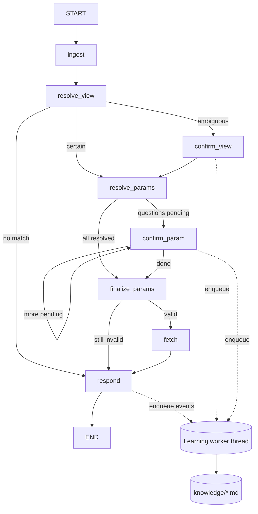

# RPA View Agent — Specification

Status: Draft v1 · Owner: TBC · Stack: Python 3.11+, LangGraph, LangChain `ChatOpenAI`

---

## 1. Purpose

A conversational agent that turns a user request into a data pull:

1. Pick the correct **view** from `RPA_VIEWS`.
2. Build a **parameter dictionary** for that view that contains every mandatory parameter and has valid values.
3. Call `get_data(view, param_dict)`, store the resulting DataFrame in a **data store**, and return a short summary (never the DataFrame itself).
4. **Learn over time.** Short descriptions of views and parameters, plus parameter formatting rules, are stored in Markdown files. Learning runs in the background, so it never slows down a response.

Guiding principles:

- **Deterministic first, LLM second.** Anything the user states explicitly is validated in code. The LLM is only used when that validation fails or when information is missing.
- **Be transparent.** Every value in the final request is labelled with where it came from (user, corrected, default, inferred, confirmed). Any correction is stated plainly to the user.
- **Ask, don't guess.** When the agent is genuinely uncertain, it pauses the graph (`interrupt`) and asks about that specific item.
- **Keep the knowledge files lean.** They are written to be read by the LLM, and every character costs tokens on later requests.
- **Fit the existing chat integration.** The compiled graph exposes the same `.stream()` / `.invoke()` / `Command(resume=...)` interface as a `create_agent` object (see §11).

---

## 2. External dependencies (provided by the host system)

| Symbol | Signature (assumed) | Notes |
|---|---|---|
| `RPA_VIEWS` | `list[str]` | Canonical view names. |
| `validate_view` | `(view: str) -> bool` | Authoritative check that a view exists. |
| `get_view_params` | `(view: str) -> {"mandatory": list[str], "optional": list[str], "default": dict[str, Any]}` | Params are identified by **name** only. The same names are the keys of the dict passed to `get_data`. |
| `valid_params` | `(param: str, value) -> list` | Allowed values for the param. `[]` means the param has no fixed list. It does not depend on the view. |
| `get_data` | `(view: str, param_dict: dict) -> pandas.DataFrame` | Raises an exception on error. |

**All of these are reached through a single adapter module (`rpa_agent/backend.py`).** No other module imports them directly. If the real signatures turn out to be different, only the adapter changes. The adapter exposes `allowed_values(param) -> list` and `is_valid(param, value) -> bool` on top of `valid_params`, and caches results in memory with a configurable TTL. **Parameter behaviour does not depend on the view.** A param's allowed values, format rules and learned knowledge are the same in every view that uses it. A view only decides *which* params are mandatory, optional or defaulted.

---

## 3. Configuration

`config.yaml` (path passed to `build_agent`; `${ENV_VAR}` placeholders are expanded):

```yaml
llm:
  model: gpt-4o-mini
  api_key: ${OPENAI_API_KEY}
  base_url: https://api.openai.com/v1      # any OpenAI-compatible endpoint
  temperature: 0
  timeout_s: 60
  max_retries: 2
  structured_output_method: json_schema    # json_schema | function_calling | json_mode
learning_llm:                              # optional; defaults to `llm`
  model: gpt-4o-mini
paths:
  knowledge_dir: ./knowledge
agent:
  view_shortlist_max: 40                   # pre-filter views before the LLM if RPA_VIEWS is larger
  fuzzy_match_cutoff: 0.92                 # deterministic view/param name normalisation
  max_param_reasks: 2
  sample_value_max_chars: 60
  max_columns_listed: 30
learning:
  enabled: true
  view_desc_max_chars: 200
  param_desc_max_chars: 150
  param_format_max_chars: 250
  max_examples: 3
  debounce_s: 2
data_store:
  max_entries: 50                          # LRU eviction
```

The LLM factory (`rpa_agent/llm.py`) creates `langchain_openai.ChatOpenAI(model=..., api_key=..., base_url=..., temperature=..., timeout=..., max_retries=...)`. Every structured call goes through `.with_structured_output(PydanticModel, method=cfg.structured_output_method)`.

---

## 4. Architecture overview



- A **LangGraph `StateGraph`** with a checkpointer (required for interrupts).
- A **learning worker** (a single background thread with a queue) is the only component that writes to the knowledge files. Graph nodes only *enqueue* `LearningEvent`s.
- A **data store** holds DataFrames keyed by dataset id.

### Fast path

If the user supplies a valid view and valid values for every mandatory parameter, the request runs with **zero LLM calls**: ingest → deterministic validation → defaults → fetch → templated response.

---

## 5. Graph state

```python
class ParamDecision(BaseModel):
    name: str
    value: Any
    source: Literal["user", "user_corrected", "default", "inferred", "user_confirmed"]
    original_value: Any | None = None     # what the user sent, when it was corrected
    note: str | None = None               # why it was corrected / inferred
    certain: bool = True

class RPAState(TypedDict, total=False):
    messages: Annotated[list[AnyMessage], add_messages]   # same key create_agent uses
    # per-request (reset by `ingest` on every new user message)
    request_text: str
    requested_view: str | None            # explicit user input
    requested_params: dict[str, Any]      # explicit user input, keyed by param name
    view: str | None
    view_source: Literal["user", "user_corrected", "inferred", "user_confirmed"] | None
    view_note: str | None
    view_candidates: list[dict]           # [{view, reason}]
    param_spec: dict                      # cached get_view_params output + valid lists
    params: dict[str, ParamDecision]      # keyed by param name
    pending_questions: list[dict]         # per-param questions for confirm_param
    dataset_id: str | None
    error: dict | None                    # {kind, message, detail}
    # conversation-level (kept across turns)
    last_request: dict | None             # {view, params} of the previous successful pull
```

---

## 6. Node specifications

### 6.1 `ingest` (deterministic, no LLM)

- Resets the per-request fields.
- Finds explicit inputs in two places, with this priority:
  1. **State keys** passed in the input dict: `requested_view`, `requested_params`. This is for programmatic callers and UIs with form fields.
  2. **Inline syntax** in the message, parsed with a regex or JSON. Examples:
     `view: sales_daily` and `params: {"region": "UK", "date_from": "2024-01-01"}`, or `@view=sales_daily @region=UK`.
- Values supplied this way are **explicit**. Everything else in the message is free text, for the LLM to interpret if needed.
- Keeps `last_request` so follow-ups like "same again for March" can reuse it (passed to the LLM as context).

### 6.2 `resolve_view`

1. **If a view was given explicitly** (no LLM):
   - Normalise it (trim, case-fold, `-`/space → `_`) and match against `RPA_VIEWS`. If there is no exact match, use `difflib.get_close_matches` with `fuzzy_match_cutoff`; accept only a **single** match.
   - Confirm with `validate_view(candidate)`.
   - If valid, set `view_source="user"` (or `"user_corrected"` with a note if normalisation or fuzzy matching changed it).
   - If invalid, go to step 2 and pass the user's value to the LLM as a strong hint.
2. **LLM selection.** Prompt inputs: the request text, the explicit hint if any, `last_request`, and `knowledge/views.md`. If there are more than `view_shortlist_max` views, the file is first pre-filtered with keyword/BM25 scoring. The prompt also tells the LLM that views with no description should be judged by name.
   - Structured output:
     `ViewChoice{ candidates: [{view, reason, confidence: "high"|"medium"|"low"}], needs_confirmation: bool, question: str | None }`
   - Check every candidate with `validate_view` and drop any that fail.
   - **Decision rule:** accept automatically only if exactly one candidate is `high` and `needs_confirmation` is false. If there are no candidates, set `error={kind:"no_view"}` and go to `respond`. Otherwise go to `confirm_view`.
   - If the user gave an invalid explicit view, the response must say so, e.g. *"`sales_dly` isn't a valid view; I used `sales_daily` instead."* This goes in `view_note`.

### 6.3 `confirm_view` (interrupt)

- Do no LLM work before `interrupt()`. The node re-runs from the top when the graph resumes, so any work before the interrupt would run twice.
- Interrupt payload:
  ```json
  {"type": "confirm_view", "question": "Which view did you mean?",
   "options": [{"id": 1, "view": "sales_daily", "reason": "..."}, {"id": 2, "view": "sales_weekly", "reason": "..."}],
   "message": "<plain-text rendering of the above for chat UIs>"}
  ```
- Accepted resume values: an option number, a view name, `{"view": "..."}`, or free text. Numbers and names are resolved in code. Free text goes to a small LLM call that maps it to one of the options or "other". Any view chosen this way is validated with `validate_view` again.
- Sets `view_source="user_confirmed"` and enqueues `LearningEvent(kind="view_confirmed", request_text, chosen, rejected=[...])`.

### 6.4 `resolve_params`

1. Load the spec with `get_view_params(view)`. For every param in mandatory ∪ optional, get its allowed values (cached per param, shared across views).
2. Load knowledge **only for this view's params** (`knowledge/params/{name}.md`).
3. **Deterministic validation of explicit params:**
   - Map each key to a param name. Try, in order: exact name; case-insensitive name (ignoring `_`, `-` and spaces); fuzzy match (single match only). If a key cannot be mapped, mark it **unmapped**.
   - A key that maps to a param this view does not accept is **not accepted by this view**. It is dropped, and the response says so.
   - Check the value:
     - If the param has a fixed list of allowed values, the value must be in it (checked with `valid_params`). Matching is case-insensitive; if a case variant matches, store the canonical spelling and set `source="user_corrected"`.
     - If the knowledge file has a learned `pattern` (regex), the value must match it.
     - Otherwise the value is **accepted as given**. When no rule exists, we trust the user.
4. **LLM pass.** This runs only if something is missing, invalid or unmapped, or if the free text implies parameter values.
   Prompt inputs: the request text, the view, the param spec (with valid lists, shortened when they are long), the relevant param knowledge, the explicit params that already passed (marked as **fixed: do not change**), and the failing ones with the reason each failed.
   - Structured output: `ParamProposal{ params: [{name, value, certain: bool, reason}], unmapped_user_keys: [{key, mapped_to|null, reason}] }`
   - Re-validate every LLM value in code. A value that fails validation becomes a question.
5. Apply `default` values to optional params that are still unset (`source="default"`). Optional params without a default are left out unless the user mentioned them.
6. Build `pending_questions` with **one entry per uncertain or invalid param**. This covers:
   - mandatory params with no value or only a low-certainty value,
   - LLM corrections marked `certain=false`,
   - values that still fail validation.

   A correction the LLM made to a user value **with `certain=true`** does not become a question. It is applied and reported in the response.

### 6.5 `confirm_param` (interrupt, loops one param at a time)

- Takes the first item from `pending_questions` and calls `interrupt()`. As in §6.3, it does no LLM work before the interrupt.
- Payload:
  ```json
  {"type": "confirm_param", "name": "region",
   "proposed": "UK", "original": "England", "reason": "...",
   "options": ["UK", "IE", "FR"], "format_hint": "ISO-3166 alpha-2",
   "message": "For **region** you wrote `England`; that isn't an accepted value. Did you mean `UK`? (reply yes, or give a value)"}
  ```
- Resume handling:
  - `yes`/`ok`/`accept` (or `{"accept": true}`) accepts the proposal.
  - Any other value is validated in code. If it fails, the node asks again, up to `max_param_reasks` times. After that, the param stays invalid and `finalize_params` reports it.
- Enqueues `LearningEvent(kind="param_confirmed" | "param_corrected_by_user", ...)`.
- Edge: loop back to `confirm_param` while `pending_questions` is non-empty; otherwise go to `finalize_params`.

### 6.6 `finalize_params` (deterministic)

- Builds `param_dict = {name: value}`.
- Checks that every mandatory param is present, every key is accepted by the view, and every enumerated value is valid.
- If any check fails, sets `error={kind:"invalid_params", detail:[...]}` and goes to `respond` **without** calling `get_data`.

### 6.7 `fetch`

- Calls `backend.get_data(view, param_dict)`. Emits progress with `get_stream_writer()({"stage": "fetching", "view": view})`.
- **On success:**
  - `dataset_id = data_store.put(df, view=view, params=param_dict, retrieved_at=utcnow())`.
  - Enqueue `LearningEvent(kind="fetch_success", view, params, request_text)`. This is evidence that these values and formats work.
- **On exception:**
  - Classify the error:
    - `param_error`: the message mentions a param name, or matches known patterns such as "invalid", "format" or "expected".
    - `view_error`
    - `no_data`
    - `connection_error`
    - `unknown`
  - Store `{kind, message, detail}` in `error`. The full traceback goes to the log only, never to the user.
  - Enqueue `LearningEvent(kind="fetch_error", view, params, error_message)`. This is the main way formatting requirements are learned.
  - There is no automatic retry in v1. A retry flag is listed under Could-have.

### 6.8 `respond` (templated; no LLM by default)

Appends a single `AIMessage`. Contents on success:

```
**Data retrieved** — id `ds_7f3a2c`
View: `sales_daily` (you specified it)
Parameters:
| param | value | source |
|---|---|---|
| region | UK | corrected from "England" — not an accepted value |
| date_from | 2024-01-01 | you specified |
| currency | GBP | default |
Size: 12,408 rows × 9 columns
Columns: store_id, sku, date, units, revenue, … (+4 more)
Sample row: {store_id: 101, sku: "A-22", date: "2024-01-01", units: 4, revenue: 19.96, …}
```

- The source column uses these labels:
  - "you specified"
  - "corrected from X — reason"
  - "default"
  - "inferred from your request"
  - "you confirmed"
- Any **correction is always stated**, as the requirement says. This applies to the view as well as to parameters.
- Explicit params the view does not accept, and keys that could not be mapped, are listed as "ignored: … (reason)".
- On error, the message says:
  - what failed, in plain language,
  - the view and params that were tried,
  - the backend's message, tidied and shortened,
  - a concrete next step (e.g. "`date_from` may need format `YYYY-MM-DD`"). Learned format hints are used where they exist.
- Optional `respond_with_llm: true` rephrases the template with an LLM. It is off by default to keep latency and tokens low.
- The node also records a `last_request` on success.

---

## 7. Data store

`rpa_agent/data_store.py`:

```python
class DatasetRecord(BaseModel):
    id: str                 # "ds_" + 6 hex chars, unique
    view: str
    params: dict[str, Any]
    retrieved_at: datetime  # UTC
    n_rows: int
    n_cols: int
    columns: list[str]

class DataStore:
    def put(self, df, view, params, retrieved_at) -> str
    def get(self, dataset_id) -> pandas.DataFrame
    def meta(self, dataset_id) -> DatasetRecord
    def list(self) -> list[DatasetRecord]
```

- The store is **in memory only** (v1). It evicts the least-recently-used entry after `max_entries`. Datasets do not survive a restart. Persistence may be added later behind the same interface.
- The store is a process-wide singleton shared with the host app (`build_agent(...)` returns it as `agent.data_store`, or it can be obtained via `get_data_store()`). This lets other components fetch a df by id.
- DataFrames **never** go into graph state or the checkpointer, because they are not serialisable and are too large.

---

## 8. Knowledge files

```
knowledge/
  views.md
  params/
    region.md
    date_from.md
  _log/events.jsonl         # append-only evidence; never sent to the LLM in the request path
```

### 8.1 `views.md` — one line per view

```markdown
# Views
<!-- managed by rpa_agent; one line per view; ≤200 chars each -->
- sales_daily: Daily units/revenue per store+SKU. Transactional actuals. Not forecasts (→ sales_forecast).
- sales_weekly: Weekly aggregates of sales_daily; use for >3-month ranges or trend questions.
- stock_level:
```

- The whole file is loaded into the view-selection prompt, so it must stay small.
  - One line per view.
  - The description is capped at `view_desc_max_chars`.
  - The style is telegraphic: what the view contains, its grain, when to use it, and pointers like `(→ other_view)` for views it is easily confused with.
- The agent syncs the file with `RPA_VIEWS` at startup. New views get an empty description. Views no longer in the list are removed.

### 8.2 `params/{name}.md`

```markdown
# date_from
- description: Start date (inclusive) of the extract window.
- format: ISO date YYYY-MM-DD. No time component. Must be ≤ date_to.
- pattern: ^\d{4}-\d{2}-\d{2}$
- valid_examples: 2024-01-01; 2023-12-31
- invalid_examples: 01/01/2024 (backend: "unparseable date")
```

- The param **name** (file name and heading) is fixed and never changed by learning. There is one file per param, shared by every view that uses it.
- `description`, `format`, `pattern` and the examples are **learned**. Each has a character budget, and there are at most `max_examples` examples of each kind.
- **Every learned field is optional and is only written when it adds something.** A param can stay a bare heading forever if nothing is ever learned about it. In particular:
  - A param with a fixed list of allowed values gets no `format` and no examples. The list from `valid_params` is authoritative, so restating it would waste tokens. At most a `description` is learned, and only if the name and values don't make the meaning obvious.
  - A self-explanatory param (e.g. `currency` with value `GBP`) gets no `description` until a confusion actually happens.
- `pattern` is optional. It is only written or kept if **every** value in the evidence log that was fetched successfully matches it. Validation in §6.4 uses it, so the agent can catch format problems without calling the LLM.
- A file is created lazily, the first time the param appears in a view's spec.

### 8.3 Parsing

The files use a fixed, line-based format so that code can parse them reliably (`- key: value`). They stay readable and editable by hand, and manual edits are respected. The learner rewrites only the fields it owns.

---

## 9. Learning

### 9.1 Events

```python
class LearningEvent(BaseModel):
    kind: Literal["view_confirmed", "view_corrected", "param_confirmed",
                  "param_corrected_by_user", "param_llm_fix_succeeded",
                  "fetch_success", "fetch_error"]
    ts: datetime
    request_text: str
    view: str | None
    rejected_views: list[str] = []
    params: dict[str, Any] = {}
    param: str | None = None
    original_value: Any | None = None
    final_value: Any | None = None
    error_message: str | None = None
```

### 9.2 When to learn (the learning gate)

Learning must pay for itself: it costs an LLM call now, and every stored character costs tokens on each later request that loads it. Every event goes through a **cheap, deterministic gate in code**, and most events stop there.

1. **Only ground-truth signals.** The learner never learns from an LLM decision on its own, because that would let errors reinforce themselves. The valid signals are listed in the table below.
2. **Only where there was friction or a gap.** The learner skips the event if it confirms what is already known. Examples:
   - `fetch_success` where every value came from the user or a default and passed validation without changes, and the view already has a description. Nothing new; log only.
   - A confirmed view whose description already names the distinguishing feature the user picked on. Log only.

   The learner proceeds when the agent got something wrong or had to ask:
   - a correction,
   - a confirmation interrupt,
   - a `fetch_error`,
   - an LLM fix that later succeeded,
   - a view or param that has no knowledge yet and was just used successfully.
3. **Novelty check before the LLM.** The learner compares the event with the current entry and the recent log. Duplicate examples, an error string already recorded, and a value that already matches `pattern` are dropped in code without an LLM call.
4. **Batch.** Events for the same file within `debounce_s` are merged into one LLM call. A param that appears in several views is still one file and one call.
5. **The LLM may decline.** The learning prompt allows `changed: false`, and in that case nothing is written. A rewrite is also discarded if it is longer than the current entry without adding a new fact. A simple length plus diff check in code decides this.
6. **No learning where a source is already authoritative.** Allowed values come from `valid_params`, and mandatory, optional and default params come from `get_view_params`. Neither is copied into the knowledge files.

| Signal | May update (subject to the gate) |
|---|---|
| `view_confirmed` / `view_corrected` (user) | Chosen view's description. Optionally adds a `(→ x)` disambiguation to the rejected views. |
| `fetch_success` | Valid examples and pattern check, for free-format params only. If a view has an empty description, writes a first description from the request text. |
| `fetch_error` (param-related) | Param `format` and invalid examples. |
| `param_corrected_by_user` / `param_confirmed` | Param description, format and examples. |
| `param_llm_fix_succeeded` (LLM fix followed by `fetch_success`) | Param format and examples. |

### 9.3 Worker

- `LearningWorker` is a single daemon thread that reads from a `queue.Queue`. It is started by `build_agent` and shut down cleanly with `agent.learning.shutdown(wait=True)`.
- **Non-blocking:**
  - Graph nodes only call `queue.put_nowait(event)`.
  - The worker uses its own LLM instance with no callbacks or stream context, so learning tokens never leak into the user's stream.
  - A failure inside the worker is logged and swallowed. It never affects the user.
- Steps:
  1. Append every event to `_log/events.jsonl`.
  2. Apply the gate in §9.2. Drop events that add nothing; most events end here. Debounce the rest for `debounce_s` and group them by target file.
  3. For each target, load the current entry and the relevant recent evidence (at most about 10 log lines for that target). Then make one structured LLM call:
     *"Update this entry. Keep correct existing info, integrate the new evidence, prefer distinguishing/actionable facts, no request-specific values except as examples, ≤N chars per field. Return unchanged if evidence adds nothing."*
     Output: `{description?, format?, pattern?, valid_examples?, invalid_examples?, changed: bool}`.
  4. Enforce the budgets in code (truncate at a word boundary). For `pattern`, compile it and test it against the success log; drop it if it fails.
  5. Write atomically (temp file + `os.replace`) while holding a per-file lock. Use the `filelock` library so that several processes can share the knowledge directory safely.
- Some updates need no LLM. Example bookkeeping, appending a known error string to invalid examples, and view-list sync are done in code.

---

## 10. Prompts (guidelines)

- Use short system prompts. Each one states the task, the output schema, and the rule *"Never invent views/params not in the provided lists."*
- Put knowledge in a clearly delimited block, for example `<views>…</views>` and `<param_knowledge>…</param_knowledge>`.
- Shorten long `valid_params` lists: show the first 30 values and add "…(N more; value must be from list)". The deterministic validation catches any mistakes.
- Tag every internal LLM call with `tags=["rpa_internal"]` and `metadata={"rpa_step": "<node>"}` so UIs can filter them out of the stream (§11.3).

---

## 11. Integration with an existing `create_agent` streaming UI

### 11.1 Construction

```python
from rpa_agent import build_agent

agent = build_agent(
    "config.yaml",
    checkpointer=None,   # default InMemorySaver(); pass your own (e.g. SqliteSaver/PostgresSaver)
    backend=None,        # default: rpa_agent.backend imports the host functions
)
# `agent` is a langgraph CompiledStateGraph — the same type create_agent(...) returns.
# Extras: agent.data_store, agent.learning (worker handle)
```

### 11.2 Same call shape as `create_agent`

```python
config = {"configurable": {"thread_id": thread_id}}
inputs = {"messages": [{"role": "user", "content": user_text}]}

for mode, chunk in agent.stream(inputs, config, stream_mode=["messages", "updates", "custom"]):
    ...
```

- The input key is `messages`, as with `create_agent`. The optional `requested_view` and `requested_params` keys can be added alongside it.
- `stream_mode="values"` and `agent.invoke(...)` both return a state whose `["messages"][-1]` is the final AI response, as with `create_agent`.
- `stream_mode="messages"` yields `(message_chunk, metadata)`. The final response is emitted as one complete `AIMessage` from node `respond`; it is not token-streamed, because it is built from a template.
- `stream_mode="custom"` yields progress dicts such as `{"stage": "selecting_view"}` and `{"stage": "fetching", ...}`. These are optional to display.

### 11.3 Filtering internal tokens

Internal LLM calls (view selection, param resolution) also produce chunks in `messages` mode. To show only user-facing output, keep chunks where `metadata["langgraph_node"] == "respond"`, or drop chunks whose `metadata.get("tags")` contains `"rpa_internal"`.

### 11.4 Interrupts (human-in-the-loop)

This uses the same mechanism as `create_agent`'s HITL middleware:

- When the graph pauses, an `"updates"` chunk contains `{"__interrupt__": (Interrupt(value=payload, ...),)}`.
- You resume with `agent.stream(Command(resume=answer), config, ...)`.

The payload schema is the one given in §6.3 and §6.5, not the HITL middleware's `action_requests` schema. Every payload includes a ready-to-display `message`.

To make plugging into a plain chat loop a one-line change, a helper is provided:

```python
from rpa_agent import make_input

def on_user_message(thread_id: str, user_text: str):
    config = {"configurable": {"thread_id": thread_id}}
    inputs = make_input(agent, config, user_text)
    # -> Command(resume=user_text) if the thread is paused on an interrupt,
    #    else {"messages": [HumanMessage(user_text)]}
    for mode, chunk in agent.stream(inputs, config, stream_mode=["messages", "updates"]):
        if mode == "updates" and "__interrupt__" in chunk:
            for intr in chunk["__interrupt__"]:
                ui.show_assistant(intr.value["message"])      # the question
        elif mode == "messages":
            msg, meta = chunk
            if meta.get("langgraph_node") == "respond":
                ui.stream_assistant(msg.content)
```

When `make_input` resumes an interrupt, it also appends the user's reply to `messages`, so the transcript stays complete.

---

## 12. Project layout

```
rpa_agent/
  __init__.py          # build_agent, make_input, get_data_store
  config.py            # YAML + env expansion → pydantic Settings
  llm.py               # ChatOpenAI factory
  backend.py           # adapter over RPA_VIEWS / validate_view / get_view_params / valid_params / get_data
  state.py             # RPAState, ParamDecision
  graph.py             # StateGraph wiring
  nodes/{ingest,view,params,confirm,fetch,respond}.py
  validation.py        # deterministic matching/normalisation/validation
  knowledge.py         # md read/write/parse, view-list sync
  learning.py          # LearningEvent, LearningWorker, learner prompts
  data_store.py
  prompts.py
config.example.yaml
knowledge/             # created on first run
tests/
```

Dependencies: `langgraph`, `langchain-core`, `langchain-openai`, `pydantic>=2`, `pandas`, `pyyaml`, `filelock`. Optionally `rank_bm25` for shortlisting.

---

## 13. Requirements summary (MoSCoW)

**Must**
- M1: When the user gives a valid explicit view, it is used without calling the LLM.
- M2: When the user gives an invalid view, the LLM chooses one and the response states the change.
- M3: When several views are plausible, the agent interrupts and asks. The confirmation is recorded as a learning event.
- M4: The final param dict contains every mandatory param, uses only params the view accepts, and has every value passing `valid_params` where the param has a fixed list.
- M5: Explicit params are validated in code. Only failures go to the LLM. Every correction is shown to the user with its source and reason.
- M6: Each uncertain param causes its own interrupt.
- M7: `get_data` is called only with a dict that passed validation. A successful df is stored in memory with a dataset id, the view, the params and the UTC time. The user receives the id, columns, a sample row and the shape, never the df.
- M8: Errors from `get_data` are returned in plain language, with the context of what was tried and a suggested next step.
- M9: Learning runs in a background thread. The response does not wait for it.
- M10: `views.md` and `params/{name}.md` are kept within their character budgets. Param names are never changed. Learning follows the gate in §9.2: no write or LLM call when the event adds nothing.
- M11: The agent exposes the same stream, invoke and resume interface as `create_agent`, with a `messages` state key.
- M12: The LLM is configured from `config.yaml` (key, URL, model).

**Should**
- S1: Learned regex `pattern`s allow format checks without the LLM.
- S2: Follow-up requests can reuse `last_request`.
- S3: Views are shortlisted when `RPA_VIEWS` is large.

**Could**
- C1: Automatically retry once after a `param_error`, using an LLM fix. The retry is reported to the user.
- C2: An intent check that answers "what views are there / what does X need?" from the knowledge files without fetching.
- C3: A `respond_with_llm` rephrasing mode.
- C4: A "that was the wrong view" feedback command that triggers a `view_corrected` event.

---

## 14. Testing & acceptance

- **Backend fake:** a fake backend with three to five views, overlapping params, enumerated and free-format params, and a `get_data` that raises on bad formats.
- **LLM fake:** `GenericFakeChatModel` or scripted structured outputs, so the tests are deterministic.

Test cases:
1. Fast path. The user supplies a valid view and params. Assert zero LLM calls (by counting calls), that the df is stored, and that the summary is correct.
2. Explicit view `Sales Daily` normalises to `sales_daily` and the correction is reported.
3. Invalid view leads to LLM selection, and the response notes the substitution.
4. An ambiguous request triggers an interrupt. Resuming with `"2"` gives the correct view, and a `view_confirmed` event is queued.
5. A missing mandatory param is inferred from text with `certain=true`. No interrupt occurs and the value is labelled "inferred".
6. An invalid enumerated value with an uncertain fix triggers one interrupt per param. Accepting it works. Giving an invalid replacement causes a re-ask, capped at `max_param_reasks`.
7. A `get_data` format error produces a friendly error message and a `fetch_error` event. After the worker runs, `params/*.md` includes the format hint and the next request applies it.
8. Latency: with a learning LLM fake that sleeps for 5 s, the response arrives in under 0.5 s, and the knowledge file updates later.
9. Budgets: the learner is fed long outputs, and the files stay within their character limits.
10. Learning gate: a repeat of a clean, already-known request makes **zero** learning LLM calls and causes no file write. A param with a fixed value list never gets `format` or examples.
11. Integration: the §11.4 loop runs end-to-end against the compiled graph using `make_input`.

---

## 15. Open questions

1. **`valid_params(param, value)` return value.** The spec assumes it returns the param's allowed values (`[]` = no fixed list), so the agent can both check a value and offer options. If it returns a bool instead, the adapter needs another way to list options for the LLM and for confirmation questions, or the options are simply left out.
2. **Dates and relative values.** Should phrases like "last month" be resolved by the LLM, which needs today's date in the prompt (planned), or by deterministic helpers?
3. **Multi-user knowledge.** Is the knowledge directory shared between users? If so, should learning from one user's confirmations affect everyone? The design assumes yes, shared.
4. **Should `respond` also stream tokens?** The current design emits the final message in one piece. If the UI expects token streaming, enable C3.
